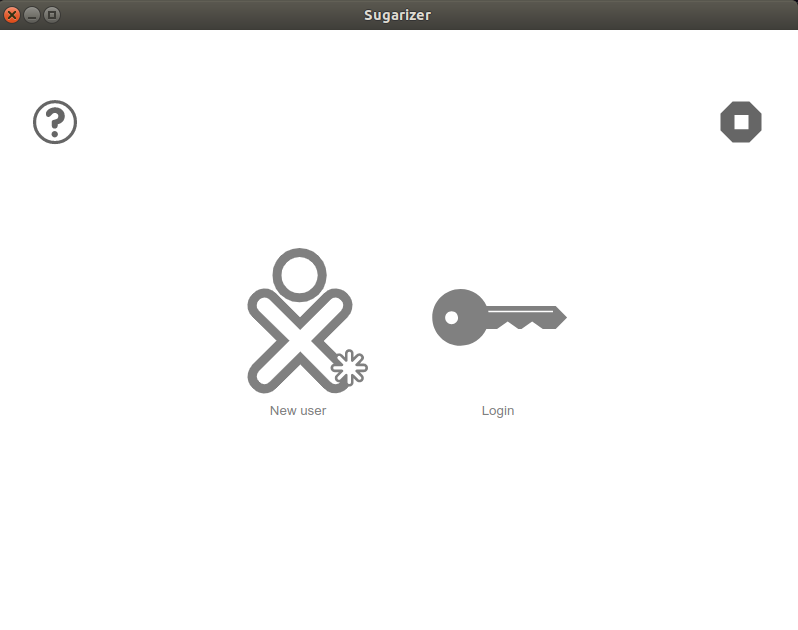
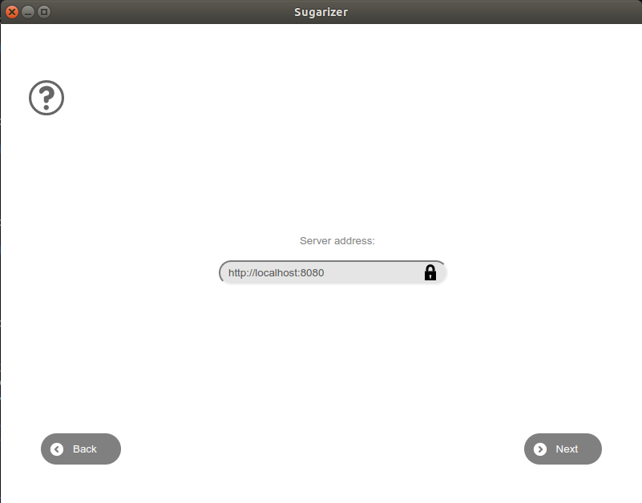

# Connected or not

Sugarizer can be installed on your machine or used through a browser. And once installed, the application can be used in both connected and disconnected modes. This flexibility allows everyone to use Sugarizer according to their needs and technical constraints. Let's take a closer look.

   

## Installed or not?

You can choose to install Sugarizer on a computer running Windows, MacOS or GNU/Linux, or on a tablet or mobile device running iOS or Android. Installation ensures optimum use of device resources and a smooth experience.

Sugarizer is also available in a web version, accessible from any browser. This means you can use Sugarizer on any device without the need to install additional software. 

The same features are available whether you choose the installed application or the web version.

## Connected to what?

Sugarizer is connected via a Sugarizer server, which can be hosted on the Internet or on a private network, for example at school. 
This server manages web access and enables the installed application to connect.

### Why be offline?

There are several advantages to using Sugarizer offline. 
Firstly, you can access the application's features without the need for an Internet connection. This is particularly useful in environments where network access is limited or intermittent. 

In offline mode, all your data is stored locally on your device, allowing you to retain full control of your personal information and work without relying on an external server.

### Why be connected?

Being logged in when using Sugarizer offers additional benefits. 
If you don't want to install the application on your device, the web version of Sugarizer is an excellent solution. 
What's more, if several users share the same device, being logged in allows each one to have a different account and access their own data. 

   

Connecting to a server also enables you to back up your data, offering protection against data loss in the event of a problem with your device. 
In addition, Sugarizer's [activity sharing](shareactivities_en.md) feature, which enables group collaboration and learning, requires a server connection.

By being connected, you can also use Sugarizer from multiple devices, for example on a tablet at school and on a computer at home, with your data retrieved on each device.

Finally, at school, being logged in enables teachers to manage and monitor educational activities.

### How do I connect?

On the web version, Sugarizer must be connected, and you can create a new account or connect to an existing one as soon as you launch it.

On the installed version, when you create an account, it is disconnected by default. This is indicated by the “Not connected” icon on the home page. To connect the application, simply click on this icon or access the “Settings/My Server” screen.

   

If you already have an account, you can also connect the application directly from the launch screen. 

### Which server?

By default, Sugarizer is connected to a public server, but you can also choose to connect to a private server. 

This could be a Sugarizer server hosted by your school or organization, or a Sugarizer server you've installed yourself. 

Simply change the server address on launch to connect to the server of your choice.

   

Connected or disconnected, installed or not, Sugarizer lets every user - student, teacher or parent - choose the configuration that suits them best for a personalized learning experience.

## Learn more

* You can test Sugarizer online [here](https://try.sugarizer.org) or download it [here](https://sugarizer.org/index.html#apps).