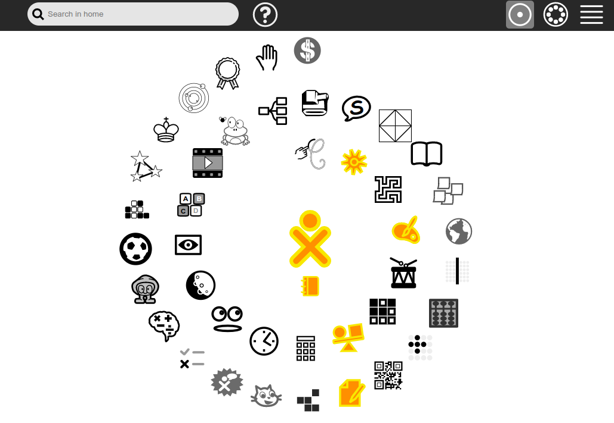
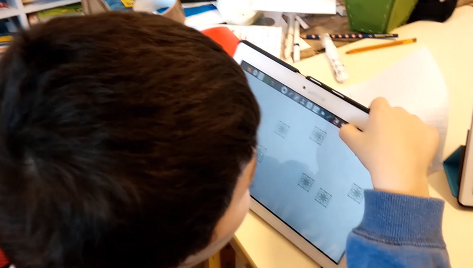

# Sugarizer from home to the classroom

What is Sugarizer? How to use it? That's what we'll find out in this article.

## Basic concepts

Sugarizer is a learning platform for children.

More precisely Sugarizer is an application including a set of pedagogic activities (more than 50) for children.
Each activity propose a type of work: read, write, explore, create, simulate or play.

The platform is the link between activities. It provide a way to launch activities, log the history of running activities, link activities together and allow to share it. 
Each user can customize the Sugarizer platform (name, colors, favorites, ...) to benefit of an unique experience.

Sugarizer was built for learners between 6 and 12. The unique Sugarizer UI is discoverable, wholly intuitive, and uses metaphors even non-readers can understand.

## At home

Sugarizer can be used at home. 
It can be installed on a computer, a tablet or a smartphone.

At home, the child usually uses Sugarizer alone: he discovers the activities and spends time on those he prefers.

Sugarizer activities do not require Internet access to function, except for those accessing content (videos, audios, books).

Sugarizer does not contain any advertising or tracking tools and is a Free, Libre Software.

## In the classroom

Sugarizer can be used in the classroom. It can be installed on tablets in mobile carts or on classroom computers.

In the classroom, the use of Sugarizer is usually directed by a teacher. The teacher integrates Sugarizer activities into curriculum-driven lessons. These sequences use Sugarizer as a tool but can also integrate other classroom tools, books, observation of the environment or physical phenomena.

Sugarizer at school is usually connected to a Sugarizer server which can be in the school or on the Internet. This server is used to save the children's work, run multi-user activities and track the children's use of Sugarizer.

With a Sugarizer server, it is possible to access usage statistics by child, by class and by activity. It is also possible for a teacher to review the productions of his students and even assign homework. If the server is connected to the Internet, the children can continue the work started in class from home.

Sugarizer server is free and requires no subscription. It can be self-hosted and is fully compliant with GPDR regulations and data privacy.

## Learn more

* A list of Sugarizer activities with a demonstration of their use is available [here](https://sugarizer.org/activities.html).
* You can test Sugarizer online [here](https://try.sugarizer.org) or download it [here](https://sugarizer.org/index.html#apps).
