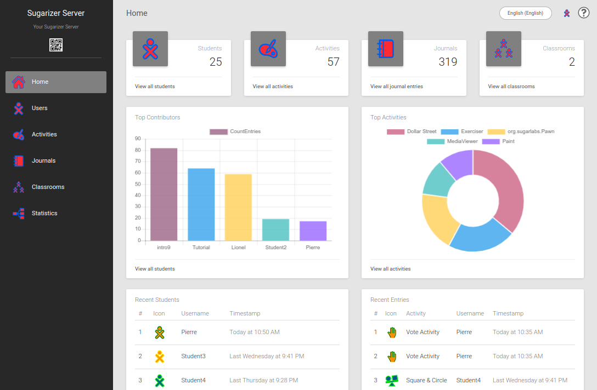

# Sugarizer de la maison à la classe

Qu'est-ce que Sugarizer ? Comment l'utiliser ? C'est ce que nous allons découvrir dans cet article.

## Principes de base

Sugarizer est une plateforme pédagogique pour enfant.

Plus précisément, Sugarizer est une application incluant un ensemble d'activités pédagogiques (plus de 50) pour enfant.
Chaque activité propose un type de travail: lire, écrire, explorer, créer, simuler ou jouer.

La plateforme Sugarizer fait le lien entre ces activités. Elle permet de lancer les activités, journalise l'historique d'exécution, permet de les combiner et de les partager. 
Chaque utilisateur peut personnaliser la plateforme Sugarizer (nom, couleurs, favoris, ...) afin de bénéficier d'une expérience unique.

Sugarizer a été conçu pour les enfants entre 6 et 12 ans. L'interface de Sugarizer est intuitive et emploie des métaphores que peuvent comprendre les enfants sans savoir encore lire.

## A la maison

Sugarizer peut être utilisé à la maison. 
Pour cela, il peut être installé sur un ordinateur, une tablette ou un smartphone.

A la maison, l'enfant utilise généralement Sugarizer seul: il découvre les activités et passe du temps sur celles qu'il préfère.

Les activités de Sugarizer n'ont pas besoin d'accès à Internet pour fonctionner, sauf celles accédant à des contenus (vidéos, audios, livres).

Sugarizer ne contient pas de publicité ni d'outil de pistage et est un logiciel libre et gratuit.

## En classe

Sugarizer peut être utilisé en classe. Il peut être installé sur des tablets dans des chariots mobiles ou sur les ordinateurs d'une salle de classe.

En classe, l'utilisation de Sugarizer est généralement dirigée par un professeur. Le professeur intègre les activités de Sugarizer dans des séquences pédagogiques adaptées au programme scolaire. Ces séquences utilisent Sugarizer comme outil mais peuvent aussi intégrer d'autres outils de la classe, des livres, l'observation de l'environnement ou des phénomènes physiques.

Sugarizer à l'école s'utilise généralement connecté à un serveur Sugarizer qui peut être dans l'école ou sur Internet. Ce serveur permet de sauvegarder le travail des enfants, d'exécuter des activités à plusieurs et de suivre l'utilisation de Sugarizer par les enfants. Si le serveur est connecté à Internet, les enfants peuvent continuer depuis chez eux les travaux démarrés en classe.

Avec un serveur Sugarizer, il est possible d'accéder à des statistiques d'usages par enfant, par classes et par activités. Il est possible aussi pour un enseignant de revoir les productions de ses élèves et même affecter des devoirs.

Sugarizer serveur est gratuit et ne nécessite aucun abonnement. Il peut être auto hébergé et est totalement respectueux de la réglementation RGPD et de la confidentialité des données.

## En savoir plus

* Une liste des activités de Sugarizer avec une démonstration de leur utilisation est accessible [ici](https://sugarizer.org/activities.html).
* Vous pouvez tester en ligne Sugarizer [ici](https://try.sugarizer.org) ou le télécharger [ici](https://sugarizer.org/index.html#apps).
* Un mini-tutorial vidéo est disponible [ici](https://youtu.be/PD_uanV7r2I).